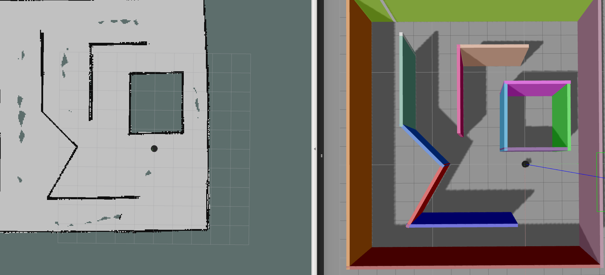

[](https://travis-ci.org/jeshoward/turtlebot_rrt) Travis Build Status 

[](https://coveralls.io/github/jeshoward/turtlebot_rrt?branch=master) Coveralls Code Coverage Status 

[](https://opensource.org/licenses/BSD-3-Clause) Software License 


# Randomly Exploring Random Tree Path Planner ROS Plugin
This plugin implements a simulated Randomly Exploring Random Tree (RRT) path planner for the Kinetic Kame release of the Robot Operating System (ROS) framework. It uses the nav_core::BaseGlobalPlanner interface and can be used on any platforms that implement the move_base package, but has been specifically tested using the simulated Turtlebot platform.

## Table of Contents
- [Personnel](#personnel)
- [Installation](#installation)
- [Usage](#usage)
- [API and Documentation](#api)
- [Known Issues and Bugs](#issues)
- [SIP Status](#sip)
- [License](#license)

## Personnel
This plugin was created by [Jessica Howard](jmhoward@umd.edu) as a final project for the University of Maryland course ENPM808X - Software Development for Robotics during the Fall 2017 semester.

## Installation
Clone the package into your catkin workspace:
```
cd [workspace]/src
git clone https://github.com/jeshoward/turtlebot_rrt.git
cd ..
catkin_make
```

### Dependencies
1. ROS Kinetic Kame [(Installation Instructions)](docs/README_DEPENDENCIES.md#ros)
2. Catkin [(Installation Instructions)](docs/README_DEPENDENCIES.md#catkin)
3. Rviz [(Installation Instructions)](/docs/README_DEPENDENCIES.md#rviz)
4. Gazebo [(Installation Instructions)](/docs/README_DEPENDENCIES.dm#gazebo)

## Usage
To run the plugin out of the box, follow the steps in the [demo](#demo-steps).
The plugin uses a static map and is currently only packaged with a single map. To create custom maps follow the instructions [provided here](#creating-custom-maps). Once you have created your map place the ```.world```, ```.yaml```, and ```.pgm``` file into the ```/maps```  directory all using the same file name and then use the ```map_name``` arg with the launch file:
```
roslaunch turtlebot_rrt rrt_planner.launch map_name:="your_map_name"
```

### Launch file args
```map_name``` indicates the map that you want to use. This assumes that you already have a ```.world```, ```.yaml```, and a ```.pgm``` file in the ```/maps``` directory.

```step_size``` indicates the size of the step that the RRT algorithm uses. Sometimes called epsilon. A lower value is more accurate, a higher value is faster. Parameter is entered in meters. Has a default value of 2.5.

```max_iterations``` determines the maximum number of vertices that will be created searching for a path between the starting point and the goal. This prevents infinite loops in the event the goal is unreachable. Parameter is an integer. Has a default value of 200,000.

```delta``` is the incremental amount that will be checked along each step_size for obstacles. Choosing a lower value is more accurate, a higher value is faster. Parameter is entered in meters. Has a default value of 1.0.

```goal_radius``` is how close you have to be to the goal for it to count. Parameter is entered in meters. Has a default value of 1.0.

### Demo Steps
These steps assume that you have already cloned the repository, if not see [Installation](#installation).

1. Run the demo launch file 
```
roslaunch turtlebot_rrt rrt_planner.launch
```


2. To set a goal for the robot switch to the Rviz window and and click "2D Nav Goal" at the top and select on the map where you want the robot to go.

#### Creating Custom Maps
A single demo map has been provided here, if you want to create your own Gazebo worlds and this RRT algorithm to navigate them follow [this](docs/MAP_CONVERSION.md) tutorial.

### Test Steps
These steps assume that you have already cloned the repository, if not see [Installation](#installation).

```
cd [workspace]/src
catkin_make run_tests && catkin_test_results
```
TODO: Add screenshot of successful tests and link to coveralls test coverage

## Issues
Issue tracking sheet can be found with the [Sprint Backlog](https://docs.google.com/spreadsheets/d/11MImRGM0dvr5bSlyq22xXTaM7s8ReXDSpWUyN7IlM3k/edit?usp=sharing) in the Issues tab.

## SIP
- [Sprint Backlog and Issue Tracking](https://docs.google.com/spreadsheets/d/11MImRGM0dvr5bSlyq22xXTaM7s8ReXDSpWUyN7IlM3k/edit?usp=sharing)
- [Sprint Planning Notes](https://docs.google.com/document/d/175Ea56UEoEn6o_A4oEjhvzU04l2S9aK262BWnC1AG4U/edit?usp=sharing)

## License
BSD 3-Clause License

Copyright (c) 2017, Jessica Howard
All rights reserved.

Redistribution and use in source and binary forms, with or without
modification, are permitted provided that the following conditions are met:
    * Redistributions of source code must retain the above copyright
      notice, this list of conditions and the following disclaimer.
    * Redistributions in binary form must reproduce the above copyright
      notice, this list of conditions and the following disclaimer in the
      documentation and/or other materials provided with the distribution.
    * Neither the name of the <organization> nor the
      names of its contributors may be used to endorse or promote products
      derived from this software without specific prior written permission.

THIS SOFTWARE IS PROVIDED BY THE COPYRIGHT HOLDERS AND CONTRIBUTORS "AS IS" AND
ANY EXPRESS OR IMPLIED WARRANTIES, INCLUDING, BUT NOT LIMITED TO, THE IMPLIED
WARRANTIES OF MERCHANTABILITY AND FITNESS FOR A PARTICULAR PURPOSE ARE
DISCLAIMED. IN NO EVENT SHALL <COPYRIGHT HOLDER> BE LIABLE FOR ANY
DIRECT, INDIRECT, INCIDENTAL, SPECIAL, EXEMPLARY, OR CONSEQUENTIAL DAMAGES
(INCLUDING, BUT NOT LIMITED TO, PROCUREMENT OF SUBSTITUTE GOODS OR SERVICES;
LOSS OF USE, DATA, OR PROFITS; OR BUSINESS INTERRUPTION) HOWEVER CAUSED AND
ON ANY THEORY OF LIABILITY, WHETHER IN CONTRACT, STRICT LIABILITY, OR TORT
(INCLUDING NEGLIGENCE OR OTHERWISE) ARISING IN ANY WAY OUT OF THE USE OF THIS
SOFTWARE, EVEN IF ADVISED OF THE POSSIBILITY OF SUCH DAMAGE.

