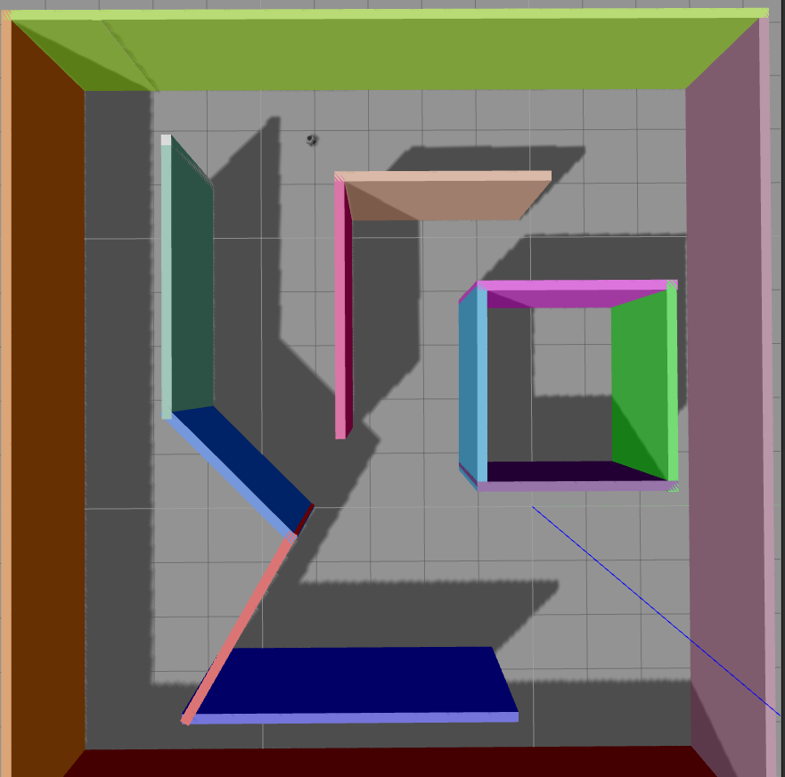

# Converting Maps from Gazebo .world Files to YAML Format
One of the requirements for this project was to provide a demo in Gazebo. Unfortunately there isn't a clean way (that I have found) to create a world in Gazebo and have it work with the costmaps required in the navigation stack.

Overall, what I did was to create a world in Gazebo. I used the building editor to create a simplified maze and then saved it as a .world file. To do the conversion I used a simulated Turtlebot3 and the packaged SLAM algorithm to drive around the map and map it in Rviz.

Unfortunately, this method does require you spend some time driving your robot around using the teleop until you are satisfied with your map.



The method I used came from the Turtlebot3 [tutorials](http://turtlebot3.readthedocs.io/en/latest/index.html) and worked on Ubuntu 16.04 running ROS Kinetic Kame.

## Installing Turtlebot3
1. The first step in installing Turtlebot3 is to install all of the dependencies. In a terminal window:
```
sudo apt-get install ros-kinetic-joy ros-kinetic-teleop-twist-joy ros-kinetic-teleop-twist-keyboard ros-kinetic-laser-proc ros-kinetic-rgbd-launch ros-kinetic-depthimage-to-laserscan ros-kinetic-rosserial-arduino ros-kinetic-rosserial-python ros-kinetic-rosserial-server ros-kinetic-rosserial-client ros-kinetic-rosserial-msgs ros-kinetic-amcl ros-kinetic-map-server ros-kinetic-move-base ros-kinetic-urdf ros-kinetic-xacro ros-kinetic-compressed-image-transport ros-kinetic-rqt-image-view ros-kinetic-gmapping ros-kinetic-navigation
```

2. The next step is to install the Turtlebot3 package
```
cd ~/catkin_ws/src/
git clone https://github.com/ROBOTIS-GIT/turtlebot3_msgs.git
git clone https://github.com/ROBOTIS-GIT/turtlebot3.git
git clone https://github.com/ROBOTIS-GIT/turtlebot3_simulations.git
cd ~/catkin_ws && catkin_make
```

Full instructions can be found [here](http://turtlebot3.robotis.com/en/latest/pc_software.html#install-dependent-packages).

3. 

## Running Turtlebot3 SLAM
Once I created my .world file in Gazebo, I modified the turtlebot3_world.launch file to point to the map I had created instead of the default map.

```xml
<launch>
  <arg name="model" default="$(env TURTLEBOT3_MODEL)" doc="model type [burger, waffle]"/>
  <arg name="x_pos" default="-2.0"/>
  <arg name="y_pos" default="-0.5"/>
  <arg name="z_pos" default="0.0"/>

  <node pkg="tf" type="static_transform_publisher" name="camera_tf" args="-1.95 -0.55 2.0 -1.58 0 -1.58 /odom /camera_link 100"/>

  <include file="$(find gazebo_ros)/launch/empty_world.launch">
    <b><arg name="world_name" value="$(find turtlebot_rrt)/maps/simple_maze.world"/></b>
    <arg name="paused" value="false"/>
    <arg name="use_sim_time" value="true"/>
    <arg name="gui" value="true"/>
    <arg name="headless" value="false"/>
    <arg name="debug" value="false"/>
  </include>

  <param name="robot_description" command="$(find xacro)/xacro.py $(find turtlebot3_description)/urdf/turtlebot3_$(arg model).urdf.xacro" />

  <node name="spawn_urdf" pkg="gazebo_ros" type="spawn_model" args="-urdf -model turtlebot3_burger -x $(arg x_pos) -y $(arg y_pos) -z $(arg z_pos) -param robot_description" />
</launch>
```
